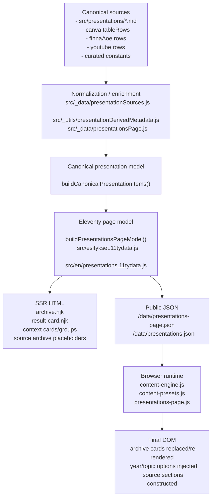

# Presentations SSR Closure Audit — 2026-08-24

Status: `REDUCE`

This is an audit-only report. No production code, presentation templates, Pagefind configuration, or shared search code were changed for this audit.

## 1. Baseline SHA

- Audit branch: `audit/presentations-ssr-closure`
- Local branch at audit start: `main`
- Local HEAD at audit start: `a3a0e8b0ca0d8207eb735661fdc58e6d5d917568`
- `git fetch origin` completed successfully during the audit
- Authoritative remote baseline: `origin/main = 2ef8f2871669d7078afa77f96505bb13590724a2`
- Prompt baseline SHA matched the fetched `origin/main`

Notes:

- The current worktree was not reset to `origin/main`; findings are based on the current checked-out repo plus the fetched `origin/main` verification above.
- The build introduced dirty cache files under `.cache/api-fallback/`; they were left untouched and are excluded from the audit commit.

## 2. Authoritative Sources

Primary repo evidence reviewed for this audit:

- `docs/site-architecture-closure-roadmap-2026-08-20.md`
- `docs/find-explore-presentations-f3c-closure-2026-08-15.md`
- `docs/presentations-pagefind-quality-f3c-p4-report-2026-08-14.md`
- `docs/presentations-topic-mapping-f3c-p5-report-2026-08-14.md`
- `docs/presentations-main-reconciliation-br1-2026-08-15.md`
- `docs/f4-research-find-explore-closure-2026-08-15.md`
- `docs/f4-r3-presentations-research-rollout-2026-08-15.md`
- `docs/pf5-impl-apa-full-list-migration-closure-2026-08-17.md`
- `src/_data/presentationsPage.js`
- `src/_data/presentationSources.js`
- `src/_utils/presentationDerivedMetadata.js`
- `src/_includes/presentations/*.njk`
- `src/esitykset.njk`
- `src/en/presentations.njk`
- `src/js/presentations-page.js`
- `src/js/content-engine.js`
- `src/_utils/contentPresets.js`
- `src/presentations/presentations.11tydata.js`
- `_site/esitykset/index.html`
- `_site/en/presentations/index.html`
- `_site/data/presentations-page.json`

Supporting command/audit evidence:

- `npm run build:local`
- `node scripts/audit-presentations-page-projection.js`
- `node scripts/audit-presentations-page-client-parity.js`
- `node scripts/audit-presentations-f3c-p6-built-output.js`
- `node scripts/audit-presentation-context-projection.js`

## 3. Current Presentations Data Flow

### Diagram

### Owner Map

| Step | Owner |
| --- | --- |
| Local presentation detail parsing | `src/_data/presentationSources.js` |
| Cross-source normalization and semantics | `src/_data/presentationsPage.js` |
| Canonical identity, landing, topic, context projection | `src/_data/presentationsPage.js` |
| Detail-page computed enrichment | `src/presentations/presentations.11tydata.js` |
| Archive SSR shell and first page | `src/_includes/presentations/archive.njk` + `src/_includes/presentations/result-card.njk` |
| Context cards/groups and local links | Nunjucks SSR partials |
| Runtime fetch/cache | `src/js/content-engine.js` |
| Runtime filtering/search/sort preset | `src/_utils/contentPresets.js` |
| Runtime archive/source DOM construction | `src/js/presentations-page.js` |

### Current architecture reading

The repo is already largely canonical-model-first:

- canonical source aggregation is build-time
- context projection is build-time
- detail pages are SSR
- Pagefind input is built from canonical/SSR layers

The remaining problem is not canonical-data ownership. The remaining problem is that the archive/discovery page still asks the browser to do deterministic content construction from canonical JSON.

## 4. JS Inventory

| JS owner | Function / area | Input | Output | Deterministic? | Interactive? | SSR candidate? |
| --- | --- | --- | --- | --- | --- | --- |
| `src/js/presentations-page.js` | `exactTopicMap`, `topicOptions` | canonical items JSON | topic lookup + datalist options | Yes | No | Yes |
| `src/js/presentations-page.js` | year option generation in `wireArchive()` | canonical items JSON | `<option>` nodes | Yes | No | Yes |
| `src/js/presentations-page.js` | `archiveCardHtml()` | canonical item | archive card HTML string | Yes | No | Later / partial |
| `src/js/presentations-page.js` | `archiveItemsForState()` | canonical items + UI state | filtered/sorted result set | Yes | Yes | No, not in the minimum slice |
| `src/js/presentations-page.js` | `renderPagination()` | page count + callback | pagination buttons | Yes | Yes | No, unless archive/source paging model changes |
| `src/js/presentations-page.js` | `sourceItemsByKey()` | canonical items JSON | per-source grouped/sorted buckets | Yes | No | Yes |
| `src/js/presentations-page.js` | `sourceFeaturedHtml()` | first item in source bucket | featured card HTML string | Yes | No | Yes |
| `src/js/presentations-page.js` | `renderSourceTableRows()` | source bucket slice | desktop table rows HTML string | Yes | No | Yes |
| `src/js/presentations-page.js` | `renderMobileSourceList()` | source bucket slice | mobile card list HTML string | Yes | No | Yes |
| `src/js/presentations-page.js` | `wireSourceSections()` | canonical items JSON | full source-section DOM | Mostly yes | Source pagination only | Yes |
| `src/js/content-engine.js` | `prefetch("presentationsPage")` | `/data/presentations-page.json` | cached item array | Yes | Infrastructure | Only after archive runtime no longer depends on JSON |
| `src/_utils/contentPresets.js` | `queryPreset("FindExplore:presentations")` | items + filters + search | sorted filtered array | Yes | Yes | No, unless archive interaction model changes |
| `src/js/starter-chips.js` | starter chips | click event | input/change dispatch | No | Yes | No |
| `src/js/table-filters.js` | generic table header sorting | DOM tables | header sort UI | No | Yes | Keep generic; not a presentations-specific migration target |
| `src/js/site-ui.js` | mobile disclosures | DOM state | open/closed details | No | Yes | No |

## 5. Grouping Audit

### Authoritative source identity

Source identity is already canonical and build-owned:

- `sourceKey` and `sourceType` are set in `src/_data/presentationsPage.js`
- `PRESENTATION_SOURCE_ORDER` defines deterministic group order:
  `aoe`, `canva`, `customMaterials`, `curatedVideos`, `videoSeries`, `youtubeVideos`, `youtube`, `slideshare`
- `sourceLabel`, `landingType`, `landingUrl`, `localPageUrl`, `externalUrl`, and `sourceUrl` are all build-owned canonical fields

### Browser grouping today

The browser still groups source sections in `sourceItemsByKey()` and `wireSourceSections()`:

- FI and EN source archive sections are emitted as empty placeholder mounts
- the browser fetches canonical JSON
- the browser buckets items by `sourceKey`
- the browser sorts each bucket by date
- the browser chooses the first item as featured
- the browser renders first-page rows/cards into empty mounts

### SSR readiness by source

| Source | Build has canonical identity? | Browser groups today? | Nunjucks has enough info? | Decision |
| --- | --- | --- | --- | --- |
| AOE | Yes | Yes | Yes | `SSR` |
| Canva | Yes | Yes | Yes | `SSR` |
| SlideShare | Yes | Yes | Yes | `SSR` |
| YouTube live feed buckets (`youtubeVideos`, `youtube`) | Yes | Yes | Yes | `SSR` |
| Curated videos / video series | Yes | Not rendered in source-specific tables today | Yes | `REMOVE` from browser grouping scope; keep archive/detail semantics |
| Local presentation links | Already SSR | No | Already SSR | `REMOVE` |

### FI / EN grouping differences

- FI source area expects desktop table + mobile list mounts.
- EN source area only emits desktop table mounts.
- `sourceItemsByKey()` has one EN-only rule: Canva rows are filtered to `item.lang === "en"`.
- The main EN archive is not language-filtered; it still receives all 218 canonical items.

Conclusion:

- deterministic grouping belongs in SSR
- current browser grouping is not a canonical-data necessity
- EN/Canva filtering is another sign that grouping logic is presentation-page-specific display logic, not domain truth

## 6. Sorting Audit

### Sorting operations found

| Surface | Sort key | Direction | Fallback | Current owner |
| --- | --- | --- | --- | --- |
| canonical item build | `date`, then source order, then title | desc / fixed | title | `sortCanonicalItems()` build-time |
| SSR archive first paint | `date` | desc | none | `archive.njk` |
| runtime archive filter result set | preset `date-desc` | desc | title from preset | browser |
| year filter options | `year` numeric | desc | none | browser |
| topic options | frequency, then alpha | desc / asc | none | browser |
| source section buckets | `date`, then title | desc | title | browser |
| featured source selection | first sorted item | desc-derived | none | browser |
| context items | `date` | desc | none | build-time |
| context groups | `date` | desc | none | build-time |
| related presentations | `date` | desc | none | SSR Nunjucks |

### Findings

- Deterministic source sorting can happen entirely at build time.
- Year/topic option sorting can happen entirely at build time.
- Source featured selection can happen entirely at build time.
- Archive interactive filtering still needs a runtime or alternate interaction owner if the current free-text search/pagination model is retained.

### Duplicate sorting today

There is avoidable duplicate ordering across layers:

- build sorts canonical items
- Nunjucks sorts archive first paint
- browser sorts filtered archive results again
- browser sorts source buckets again

Recommendation:

- keep one canonical ordering contract at build time
- allow runtime resort only where interaction truly needs it
- remove browser-side source-bucket sorting first

## 7. Featured Audit

There are two different “featured” concepts:

1. `feature-highlights.njk`
   - already SSR
   - driven by `highlightedContextItems`
   - not a browser-migration issue

2. source-section featured items
   - current owner: `sourceFeaturedHtml()` in the browser
   - rule: first item in date-desc sorted bucket
   - semantics: “latest item in this source section”, not canonical editorial taxonomy

Findings:

- source featured membership is deterministic
- source featured ordering is deterministic
- browser JS currently chooses and renders featured cards
- FI source sections also create a second mobile representation for the same section slice

Decision:

- source-section featured cards should move to SSR
- no new featured taxonomy is needed

## 8. Source-Specific Audit

| Source | Canonical identity | Current HTML owner | Runtime JS owner | Landing semantics | SSR opportunity |
| --- | --- | --- | --- | --- | --- |
| Canva | design id / mapped local page / canonical record | FI + EN templates emit empty mounts | `wireSourceSections()` | local-first when local detail exists, else external Canva | High |
| SlideShare | normalized SlideShare URL + optional local page | FI + EN templates emit empty mounts | `wireSourceSections()` | local-first when local detail exists, else external SlideShare | High |
| AOE | canonical AOE record | FI + EN templates emit empty mounts | `wireSourceSections()` | external-first | High |
| YouTube live feed buckets | canonical YouTube records | FI + EN templates emit empty mounts | `wireSourceSections()` | external-first | High, but current dataset is empty |
| Curated videos | canonical curated video records | archive SSR first page only | archive runtime | mixed local/external-first | Not a separate source-table migration now |
| Video series | canonical video-series records | archive SSR first page only | archive runtime | mixed local/external-first | Not a separate source-table migration now |
| Local presentation pages | SSR detail pages + SSR local-links list | Nunjucks | none | local | Already SSR |

Important preserved semantics:

- `pageUrl`, `localPageUrl`, `sourceUrl`, `externalUrl`, and `landingUrl` are already canonical
- local/external-first behavior is build-owned and must not be flattened
- source types should remain distinct

## 9. Desktop / Mobile HTML Audit

### Current state

- Main archive cards use one shared card structure.
- FI source sections use two separate render targets per source:
  - desktop table body
  - mobile card list
- EN source sections omit the mobile list entirely.
- No `cloneNode()`-style duplication exists, but the browser does generate duplicate desktop/mobile representations from the same data slice.

### Built HTML before JS

From `_site/esitykset/index.html` and `_site/en/presentations/index.html`:

- archive SSR cards present on first paint: `12` in FI, `12` in EN
- topic datalist options on first paint: `0`
- year options on first paint: `1` placeholder only
- featured source containers on first paint: empty
- source table bodies on first paint: empty
- FI mobile source lists on first paint: empty placeholders

### After JS on current dataset

Current canonical counts:

- AOE: `9`
- Canva: `79`
- SlideShare: `115`
- YouTube live buckets: `0`

Current first-page FI source DOM after JS would contain:

- `3` featured cards
- `18` desktop table rows
- `18` mobile list items

That is `18` duplicate mobile representations of rows that are already represented in desktop tables.

Current first-page EN source DOM after JS would contain:

- `3` featured cards
- `18` desktop table rows
- no mobile list duplication

### Source LOC related to the duplicate structure

- `src/_includes/presentations/source-archive-canva.njk`: `57` lines
- `src/_includes/presentations/source-archive-slideshare.njk`: `58` lines
- `src/_includes/presentations/source-archive-youtube.njk`: `66` lines
- `src/_includes/presentations/source-archive-aoe.njk`: `33` lines
- total source-section template LOC: `214`
- browser source render logic in `src/js/presentations-page.js`: roughly `200+` presentation-specific lines

Conclusion:

- FI source sections have meaningful desktop/mobile duplication
- one semantic SSR structure per source section would be simpler than current empty-mount + JS desktop + JS mobile split

## 10. Year / Topic Option Generation

Current owner: browser JS in `wireArchive()`

Behavior:

- years are derived from canonical `item.year`
- years are deduplicated
- years are sorted descending
- topics are derived from canonical `item.topics`
- topics are deduplicated with counts
- topics are sorted by count desc, then alpha
- exact-topic matching uses normalized lookup from canonical topic strings

Findings:

- generation is deterministic
- generation uses canonical JSON, not DOM scraping
- no new taxonomy is inferred
- no topic-to-Research inference is added

Decision:

- SSR candidate: `YES`

## 11. Runtime JSON

| JSON endpoint / file | Browser consumer | Purpose | Public contract? | Can runtime fetch be removed? |
| --- | --- | --- | --- | --- |
| `/data/presentations-page.json` | `ContentEngine.prefetch("presentationsPage")` from `src/js/presentations-page.js` | archive filtering/search/pagination, year/topic options, source section grouping/render | Yes; also consumed by audits and Pagefind build helpers | Partially. Source sections and option generation can stop depending on it first, but the current archive interaction model still depends on it. |
| `/data/presentations.json` | none in browser | local detail projection feed for tests/Pagefind/audits | Yes | Already not a browser fetch; do not delete based on this audit. |

Important:

- this audit does **not** support deleting `/data/presentations-page.json`
- this audit does **not** support deleting `/data/presentations.json`

## 12. Client-Side HTML Formatter Duplication

Client-side presentation HTML builders in `src/js/presentations-page.js`:

- `archiveCardHtml()` lines `205-258` — about `54` LOC
- `sourceFeaturedHtml()` lines `433-458` — about `26` LOC
- `renderSourceTableRows()` lines `460-523` — about `64` LOC
- `renderMobileSourceList()` lines `525-554` — about `30` LOC
- `renderPagination()` lines `260-278` — about `19` LOC

Approximate presentation-specific HTML-construction total:

- about `193` LOC, excluding state/event wiring

Existing Nunjucks duplication:

- `archiveCardHtml()` duplicates the job of `src/_includes/presentations/result-card.njk`
- but it is not semantically identical:
  - JS truncates description
  - JS adds `?returnTo=...` to local presentation detail links
  - SSR card does not currently add that query decoration

Implication:

- source-section HTML builders are clean SSR-deletion candidates
- archive card formatter is a **later** consolidation candidate, not the minimum safe deletion slice

## 13. Interactive vs Deterministic Classification

### A. Deterministic content construction

- source grouping by `sourceKey`
- source section sorting
- source featured choice
- source table row/card HTML
- year option generation
- topic option generation
- first-paint archive card structure parity

### B. Interactive filter state

- search input state
- year/topic selection state
- starter chips
- reset behavior

### C. Search

- client-side free-text search through `ContentPresets.queryPreset()`

### D. Pagination / load more

- archive page buttons
- source-section page buttons

### E. Disclosure / navigation

- mobile disclosure open/close state
- `returnTo` query decoration for local detail hops

Conclusion:

- immediate SSR migration target is `A`
- `B/C/D/E` should remain JS-owned in the minimum slice

## 14. FI / EN Audit

### Shared

- both pages use `buildPresentationsPageModel()`
- both pages use the shared archive partial
- both pages load the same archive runtime JS
- both pages expose the same canonical archive size: `218`

### Differences

- FI page is the fuller architecture-closure surface:
  - hero
  - routes
  - feature highlights
  - background and sources
  - mobile source lists
  - SSR local-links section
- EN page is a simpler legacy/stubbed presentation surface with:
  - shared archive partial
  - hand-written source sections
  - no mobile source list structure
  - no equivalent SSR local-link/context-stack surface

### Parity gaps

- EN archive is not language-filtered; it still receives all `218` canonical items.
- Only EN Canva source sections are explicitly filtered to `item.lang === "en"`.
- Current canonical language distribution:
  - `canva lang=en`: `15`
  - `canva lang=fi`: `60`
  - `lang blank`: `143` records across SlideShare, curated videos, AOE, video series, and some Canva
- Local detail pages are still `/presentations/...`; EN does not have equivalent English local-detail coverage, which matches the known accepted gap.

Conclusion:

- preserve the current accepted FI/EN asymmetry
- do not try to “fix” EN local-detail coverage in this migration
- any SSR slice must preserve that EN can remain structurally narrower

## 15. Accessibility

Current browser-generated presentation DOM has these issues/opportunities:

- no-JS users get only the first `12` archive cards; source lists remain empty
- year/topic options are absent before JS
- FI source lists create duplicate desktop/mobile representations from the same slice once JS runs
- archive `innerHTML` replacement recreates result cards, which can reset focus/virtual cursor context during interaction
- source sections are more brittle because headings exist without content until JS succeeds

Accessibility wins available from SSR migration:

- source-section content becomes available without JS
- year/topic options are present on first paint
- fewer empty landmark/heading regions
- FI duplicate desktop/mobile presentation rows can be reduced or eliminated
- less DOM replacement for deterministic content

## 16. SEO

Current initial HTML facts:

- archive first paint contains only `12` canonical cards
- source sections contain headings and explanatory copy, but no rows/items
- featured source items are absent from initial HTML

JS-dependent content on archive pages today includes:

- source labels in source-specific rows
- source-specific dates in source-specific rows
- source-specific links
- source-specific featured items
- source-specific grouped lists
- topic/year option values

What is already crawlable:

- presentation detail pages
- SSR local-links list
- context cards/groups
- the first `12` archive cards

Conclusion:

- this is not an “all presentation content is invisible to crawlers” situation
- but source-specific archive content is still meaningfully JS-dependent
- moving source-specific lists to SSR would improve crawlability and semantic stability without redefining canonical content

## 17. Complexity Measurements

Measured during this audit:

- presentation-specific browser JS LOC: `616` (`src/js/presentations-page.js`)
- build-side page-model LOC: `1388` (`src/_data/presentationsPage.js`)
- source-section template LOC: `214`
- runtime browser JSON fetches for the page: `1` (`/data/presentations-page.json`)
- presentation page scripts on FI archive page: `12` total script URLs, of which `4` are directly required for archive hydration:
  - `/js/pe-list-render.js`
  - `/js/content-presets.js`
  - `/js/content-engine.js`
  - `/js/presentations-page.js`
- deterministic client HTML formatter LOC: about `193`
- canonical presentations: `218`
- local-first canonical presentations: `138`
- external-first canonical presentations: `80`
- topicless canonical presentations: `20`
- legacy local-detail projection count: `139`
- initial SSR archive card count: `12`
- initial SSR source rows: `0`
- post-JS first-page FI source representations on current data: `39` (`3` featured + `18` desktop rows + `18` mobile rows)
- post-JS first-page EN source representations on current data: `21` (`3` featured + `18` desktop rows)
- built page size:
  - FI HTML bytes: `338270`
  - EN HTML bytes: `272372`

These are complexity baselines, not user performance metrics.

## 18. Deletion Ledger

| Candidate | Current owner | Consumers | SSR replacement | Safe after migration? | Expected deletion |
| --- | --- | --- | --- | --- | --- |
| Source grouping by `sourceKey` | `src/js/presentations-page.js` | FI + EN source archive sections | Nunjucks build-side grouped buckets or direct per-source loops | Yes | ~20 LOC + JS mount logic |
| Source-section featured builders | `sourceFeaturedHtml()` | FI + EN source archive sections | SSR featured partial/macro | Yes | ~26 LOC |
| Source-section table row builders | `renderSourceTableRows()` | FI + EN source archive sections | SSR row partial(s) | Yes | ~64 LOC |
| FI mobile source list builders | `renderMobileSourceList()` | FI source archive sections | SSR single semantic structure or SSR mobile variant | Yes | ~30 LOC |
| Source-section pagination render path | `wireSourceSections()` + `renderPagination()` | FI + EN source archive sections | SSR first page or simpler non-JS source lists | Yes, if source lists are simplified | ~30-50 LOC |
| Year option generation | `wireArchive()` | archive filters | SSR `<option>` markup | Yes | ~10 LOC + DOM mutation |
| Topic option generation | `topicOptions()` + `wireArchive()` | archive filters | SSR `<datalist>` markup | Yes | ~20 LOC + DOM mutation |
| Exact topic lookup creation | `exactTopicMap()` | archive filters | SSR option list + existing normalized lookup, or keep tiny runtime helper | Partially | ~10 LOC if fully consolidated |
| Archive first-page HTML duplication | `archiveCardHtml()` | archive search/pagination | shared SSR/client renderer or later Pagefind/interaction redesign | Not in the minimum slice | ~54 LOC later |
| Runtime `prefetch("presentationsPage")` for source sections | `src/js/content-engine.js` caller path | archive + source sections | source data already SSR | Partially | caller deletion only; fetch infra still needed |
| Empty source mounts in templates | FI + EN Nunjucks templates | source sections | real SSR rows/cards | Yes | placeholder-only markup simplification |

If only the minimum recommended slice is taken, the likely immediate deletion is the source-section construction path plus option generation, not the entire archive runtime.

## 19. Proposed Minimum SSR Migration

### Recommended slice order

1. SSR source-specific sections
2. SSR year/topic option lists
3. Later archive renderer consolidation only after a separate interaction decision

### Slice 1 — SSR source-specific sections

Goal:

- move deterministic source grouping, featured choice, and first-page row/card rendering to build time
- leave archive search/filter/pagination JS untouched

Likely files changed:

- `src/_includes/presentations/source-archive-canva.njk`
- `src/_includes/presentations/source-archive-slideshare.njk`
- `src/_includes/presentations/source-archive-youtube.njk`
- `src/_includes/presentations/source-archive-aoe.njk`
- `src/en/presentations.njk`
- possibly add one or more new Nunjucks partials/macros under `src/_includes/presentations/`
- possibly expose pre-grouped buckets from `src/_data/presentationsPage.js`

Exact JS deleted or shrunk:

- `sourceItemsByKey()`
- `sourceFeaturedHtml()`
- `renderSourceTableRows()`
- `renderMobileSourceList()`
- most of `wireSourceSections()`
- source-only use of `renderPagination()` if source sections no longer paginate client-side

Exact SSR output added:

- featured source cards in initial HTML
- first-page source rows/cards in initial HTML
- optional single-structure mobile/desktop solution for FI

Regression tests:

- built HTML contains non-empty featured/source rows before JS
- local/external landing semantics preserved per source
- EN Canva still respects current English-only source-section rule

Browser tests:

- source links visible before JS-enhanced interaction
- source sections still function with `table-filters.js` if retained

Accessibility tests:

- no empty source headings on first paint
- no duplicate first-page FI desktop/mobile accessibility regressions

Build tests:

- existing presentations built-output audit
- existing page projection audit

### Slice 2 — SSR year/topic option generation

Goal:

- remove deterministic option generation from the browser
- improve no-JS archive usability without changing archive interaction ownership

Likely files changed:

- `src/_includes/presentations/archive.njk`
- `src/_data/presentationsPage.js`
- `src/js/presentations-page.js`

Exact JS deleted or shrunk:

- year option append block
- topic option append block
- likely `topicOptions()`
- possibly part of `exactTopicMap()` if the remaining lookup can be simplified

Exact SSR output added:

- all year `<option>` values
- all topic `<datalist>` options

Regression tests:

- `_site/esitykset/index.html` and `_site/en/presentations/index.html` contain populated year/topic options before JS

Browser tests:

- existing archive search/year/topic filtering still works

Accessibility tests:

- controls remain properly labeled and usable without waiting for JS

Build tests:

- current archive smoke

### Slice 3 — Later archive renderer consolidation

Goal:

- remove duplicate archive card rendering logic only after the archive interaction owner is decided

Why not in the minimum slice:

- current archive interactivity still depends on client filtering/search/pagination over canonical JSON
- `archiveCardHtml()` and `result-card.njk` are similar but not fully identical because of `returnTo` behavior and truncation
- this slice is more likely to interact with current search/discovery work

## 20. Pagefind-Readiness Impact

This migration would improve Pagefind readiness indirectly:

- SSR source/archive content means Pagefind sees stable human-readable HTML
- fewer JS-only source lists means better archive-side semantic stability
- deterministic labels, dates, and links become present on first paint

But this audit does **not** recommend:

- changing canonical presentation schema
- redesigning presentation search filters for Pagefind convenience
- making a full presentations Pagefind archive decision now

Principle preserved:

- Nunjucks renders truth
- Pagefind finds, filters, and ranks
- JS owns only genuine interaction

## 21. Conflicts / Dependencies

The current search hotfix lane may touch:

- Pagefind boundaries
- shared search/indexing code
- searchable detail content

This audit therefore recommends:

- keep the minimum SSR slice confined to presentation templates, presentation page model exposure, and presentation-specific JS
- do not tie the migration to shared search code or hotfix-specific behavior
- do not use unmerged hotfix details as a dependency for this change

Highest conflict risk by slice:

- Slice 1: low to medium
- Slice 2: low
- Slice 3: medium to high

## 22. Final Decision

`REDUCE`

Reason:

- meaningful deterministic browser logic still exists in the presentations domain
- the clearest deletion opportunity is the source-section construction path and deterministic option generation
- however, the archive search/filter/pagination renderer is still coupled to the current interactive JSON-driven archive model
- the smallest coherent migration is therefore a reduced SSR slice, not a full browser-logic shutdown for the entire presentations archive

## Summary

Current presentations architecture is already canonical-model-first, but the browser still owns too much deterministic display work on the archive pages.

The strongest SSR candidates are:

- source-specific grouping and featured selection
- source-specific HTML row/card generation
- FI mobile duplicate source-list generation
- year/topic option generation

The browser logic that should remain for now is:

- archive filter state
- free-text search
- pagination
- disclosure/mobile behavior

Recommended next move:

- take Slice 1 and Slice 2 only
- leave Slice 3 for a later interaction-specific decision
